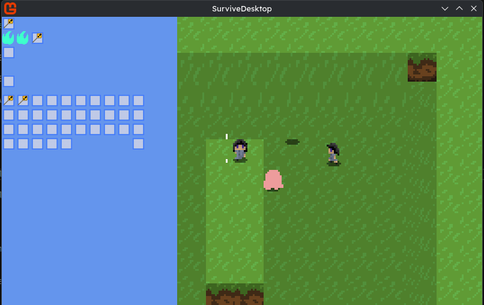

# Survivable Engine

A rebuild of my engine for [Everlost Isle](https://cubee.games/?rel=games&sub=everlost_isle) to be more focused on data files and extensibility, and overall just coded better.
This engine is intended to be used primarily for Everlost Isle (which was internally known as Survive, hence the name), though I may use it for other projects if their gameplay is similar enough.

Built on:
- Monogame 3.8.4.1 (.NET 9.0)
- [Newtonsoft.Json](https://www.newtonsoft.com/json)
- [MoonSharp](https://www.moonsharp.org/)
- [SoundFlow](https://github.com/LSXPrime/SoundFlow)

So far, I've:
- Set up an Instance system able to run as different modes like Server or Client. Also allows to have multiple game clients run in the same executable, potentially useful for split-screen.
- Set up a ticking system, so the update rate of each instance can be modified and the game's framerate can be unlocked without adversely affecting the game loop.
- Made a runtime-loading asset system called Warehouse, which lets me load Json, Lua, and PNG files at runtime for loading mods.
- Added an Entity/Mob system that can somewhat be controlled through basic Lua scripting and inherits properties from Json files.
- Made a simple world generator system that uses a List of Lua routines to build a world.
- Made entities smooth their visual position between ticks, if the framerate is higher than the tickrate.

Notable milestones to-do:
- Add tile entities.
	- Don't-Starve-like tiles that can be solid and don't typically move, but are also not necessarily locked to the grid like normal tiles.
- "Buckets" for handling collisions.
- Collisions between entities and tile entities.
- Items and inventory interfaces, general UI controls.
- Saving worlds and players.
	- Should players be per-world as before like Stardew, or separate like Terraria?
- Multiple worlds/"dimensions" per-save with their own mobs and world properties.
	- "Portals" with destination world/position. (may be doorways, caves, or literal portals)
	- Mob spawns, biome generators, etc.
- Networking/splitscreen/multiplayer?
	- Actual differences between host/client/dedicated modes.
	- Might look into MonoSync and Backdash.
- Game progression triggers.
	- May be step-by-step or simple boolean.
	- May have dependencies before availability. May optionally need to be fulfilled specifically after being made available, or can be completed beforehand without applying effects until later.

Controls:
- Arrow Keys / WASD - Move.
- Left Shift - Run.
- Space - Jump. (temporary, we'll see if I want jumping as a mechanic in Everlost Isle later on)
- J, K, L - Adjust tickrate. (/8, x8, x16)
- Left Alt - (while held) Print tick stats to the console.

Special Controls (Hold Right CTRL):
- R - Reload all asset packs.

